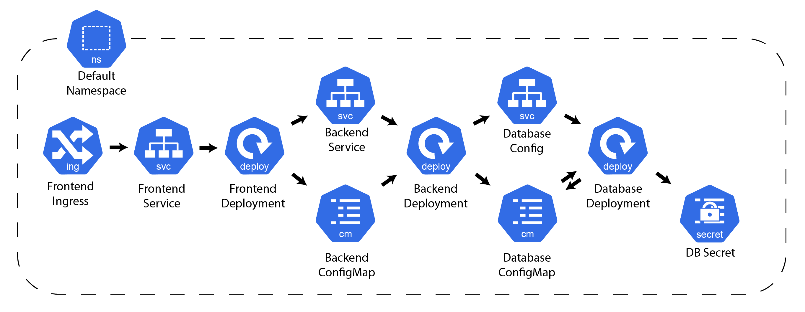
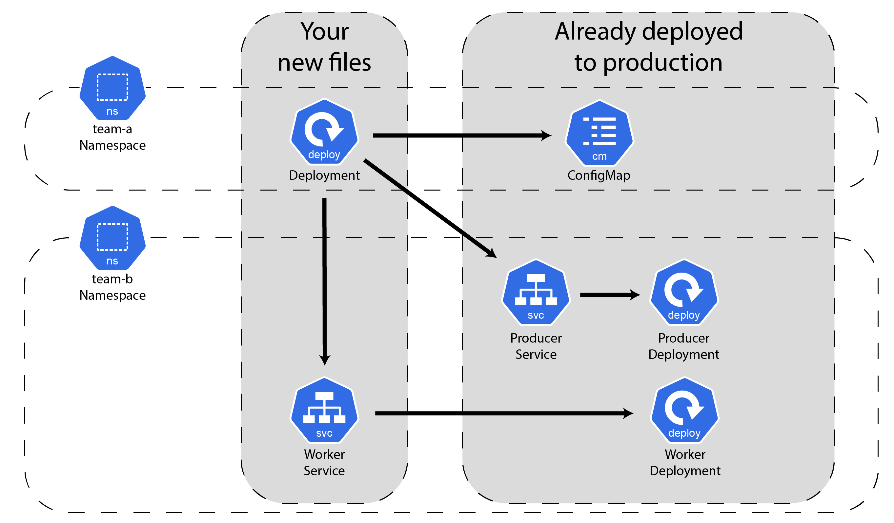
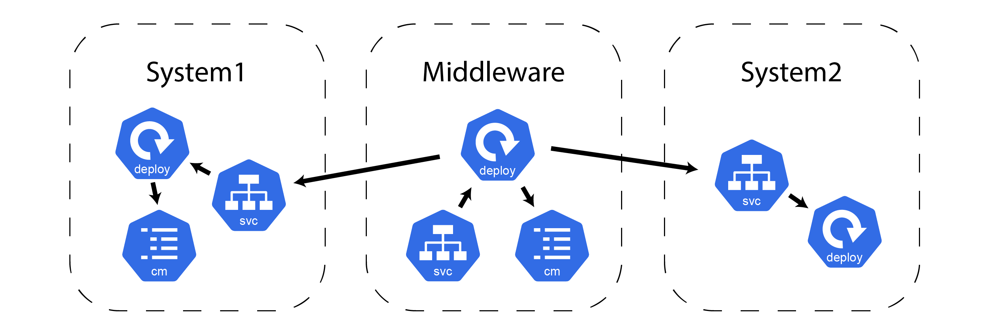
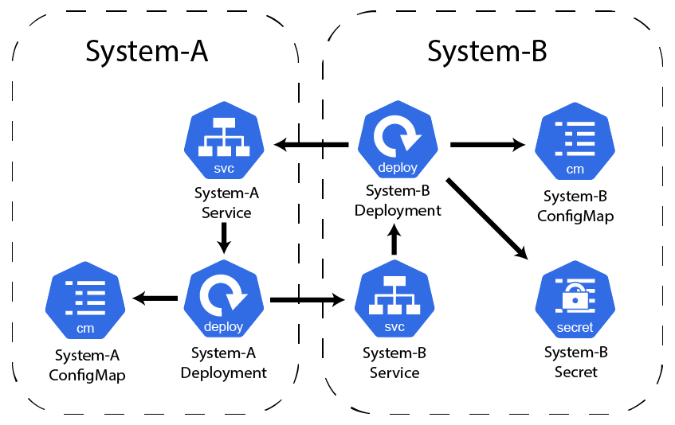

# Assignments for testing KRH

## Rules:
- You are allowed to read the README, before starting the assignments.
- You are *not* allowed to add or delete files
- You are *not* allowed to move files.
- You are *not* allowed to change the yaml-structure or add/delete/modify new fields to each Kubernetes Resources
- You are *not* allowed to change the namespace or name of resources. 
- You can use a terminal all you want. 
- Each assignment should be opened as new window - So the assignment files are the only files in the workspace.

## Broken Reference Example

<table>
<tr>
<th> Pod </th>
<th> ConfigMap </th>
</tr>
<tr>
<td>

```yaml
apiVersion: v1
kind: Pod
metadata:
  name: my-pod
spec:
  containers:
    - name: my-container
      image: "org/image"
      env:
      - name: "DB_PASSWORD"
        valueFrom:
          configMapKeyRef:
            name: my-configgg  ⬅️ ❌ WRONG REFERENCE ❗️
            key: DB_PASSWOOORD ⬅️ ❌ WRONG REFERENCE ❗️
```

</td>
<td>

```yaml
apiVersion: v1
kind: ConfigMap
metadata:
  name: my-config
data:
  DB_PASSWORD: "Sheeesh"
```

</td>
</tr>
</table>

---

# 1) A simple website

<!---
Scanning Technique: Workspace
References: ingress ref, service, configMap|secret ref, free service)
--->

## Descriptions
You want to deploy your 3 layered stack to Kubernetes. The system contains a *frontend*, *backend*, and *database*.

Users report that they can't access the frontend. You investigate and realize that the frontend simply doesn't receive any requests.

Furthermore, you check the logs and see that the frontend prints the error message: "Can't access data."

You want to check there is no issue related to broken references between the Kubernetes Resources.

The files can be seen in `./assignment1`

## Task
- Fix the broken references (4)

## Diagram

This is a diagram of Kubernetes resources and how they depend on each other. 



<!---
## Answer
- fix ingress service pointer
- fix selector for service
- fix configMap|secret ref reference
- fix free 
--->

---

# 2) External team dependency

<!---
Scanning Technique: Cluster
References: free service, configMap|secret ref, service)
--->

## Descriptions
You are a software developer in a large company. 

Your team (Team A) is building a new system that depends on another team's (Team B) service. The new system only consists of a single `Deployment` that needs to access a system called *worker* and a system called *producer*. The *Worker*-deployment does not have a `Service` yet, so you are going to make that for Team B, so you can access their service.

You have read access to a cluster to investigate the other team's resources.
All Team B's Kubernetes resources are located in the `team-b`-namespace.

A diagram of the final result can be seen in the diagram below.

The files needed can be seen in `./assignment2`

## Task
- Fix the broken references (3)

## Diagram

This is a diagram of Kubernetes resources and how they depend on each other. 



<!---
## Answer
- fix reference to configMap in cluster
- fix selector in service in workspace
- fix free service ref to deployment in cluster.
--->
---

# 3) Middleware

<!---
Scanning Technique: Kustomize
References: kustomize build, free service, configMap|secret ref)
--->

## Descriptions
Your team has 2 systems running in production. The systems are named `system1` and `system2` and are built using *Kustomize*.

The team needs to build a simple integration between the two systems. The new system is named *middleware*, and it is your job to create the Kubernetes Manifests for the new system.

The files needed can be seen in `./assignment3/middleware`

## Hint
- Pay attention to the namespaces.

## Task
- Fix the broken references (3)
- Fix the broken Kustomize file (1)

## Diagram

This is a diagram of Kubernetes resources and how they depend on each other. 



<!---
## Answer
- fix deployment arguments
- fix broken config map issues.
- fix wrong filename
--->
---

# 4) Confusion

## Descriptions
Your team is new to Kubernetes, and they don't know any good practices regarding the naming and folder structure of Kubernetes resources.
They are currently working on a few projects and experimenting with some new systems in the same repo. This means there is a lot of random files and incomplete systems lying around in the repo.

Luckily you don't need to worry about that since you will only be working in two isolated folders, `./assignment4/system-a` and `./assignment4/system-b`.

A diagram of the final result can be seen in the diagram below.

## Note
- None of the resources have a namespace specified.

## Task
- Fix the broken references (X)

## Diagram

This is a diagram of Kubernetes resources and how they depend on each other. 



<!---
## Answer
- something
--->


<!---
# Questions after
What did help you the most?
Did the extension help?

---

## things to include

### Features
- kustomize reference
- kustomize build
- Cluster
- normal workspace
- namespace sensitive free service ref

### Resources
1. ingress ref to service
2. service ref to deployment
3. free ref to service
4. deployment to secret
5. deployment to config map

--->