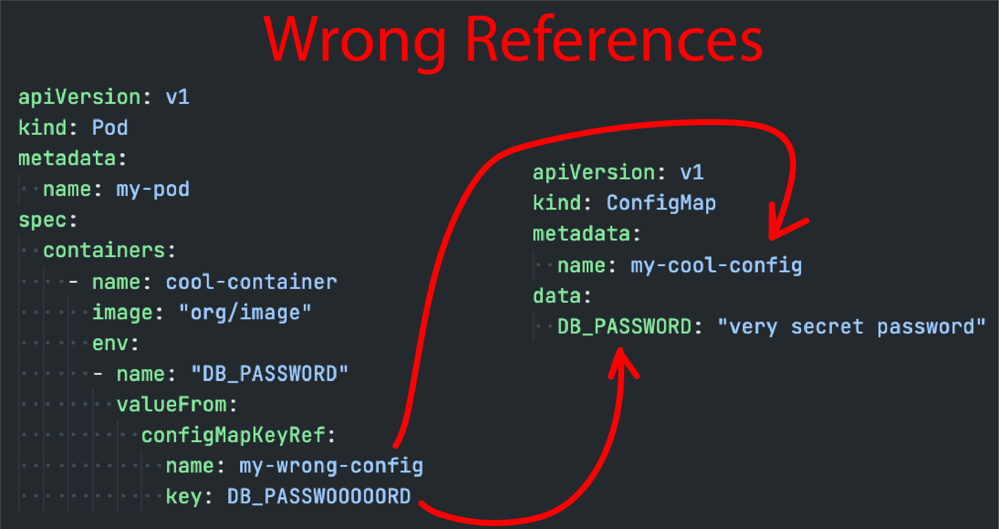
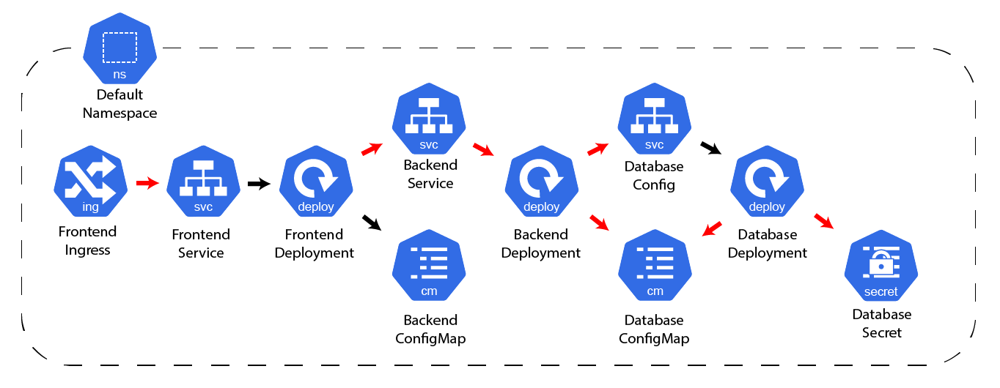
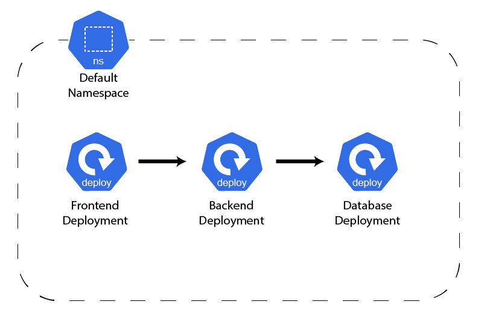

# Testing the [_KRH_](https://marketplace.visualstudio.com/items?itemName=dag-andersen.kubernetes-reference-highlighter)

These 4 small challenges/scenarios will test how many and how fast users of the KRH find and fix bugs caused by broken references in Kubernetes manifests. Each challenge will run until the participant has either found and fixed all the issues or 5 minutes have passed.

The point is not to test the users knowledge of Kubernetes, but instead... 

## How long does it take?

- 5 minutes introduction
- 4 scenarios, 5 minutes each.
- 5 minutes of questions. 

= around ~30 minutes 

## Rules
- You are allowed to read this README, before starting the challenges.
- You are allowed to read the [marketplace page](https://marketplace.visualstudio.com/items?itemName=dag-andersen.kubernetes-reference-highlighter), before starting the challenges.
- You are *not* allowed to add, delete, or move files
- You are *not* allowed to change the yaml-structure or add/delete/modify new fields to each Kubernetes Resources
- You are *not* allowed to change the namespace or name of resources. 
- You can use a terminal all you want. 
- Each challenge should be opened as new window - So the files are the only files in the workspace.

### Participants using the [_KRH_](https://marketplace.visualstudio.com/items?itemName=dag-andersen.kubernetes-reference-highlighter) 
- All features are allowed during the tests.
- All features can be enabled and disabled during the test if needed.

## Broken Reference Example

## Correct Reference Example

---

# 1) A simple website

<!---
Scanning Technique: Workspace
References: ingress ref, service, configMap|secret ref, free service)
--->

## Descriptions
You want to deploy your 3 layered stack to Kubernetes. The system contains a *frontend*, *backend*, and *database*; Each containing one or more kubernetes resources.

Users report that they can't access the frontend. You investigate and notice that the frontend simply doesn't receive any requests. Furthermore, you check the logs and see that the frontend prints the error message: "_Can't access data._"

You want to check if there are issues related to broken references between the Kubernetes Resources.

The files can be seen in `./challenge1`

## Task (Max 5 minutes)
- Find and fix the broken references

## Diagram

Your company has a diagram that shows how the Kubernetes resources are supposed to depend on each other. 

<!--  -->
<!--  -->

<!---
## Answer
- fix ingress service pointer
- fix selector for service
- fix configMap|secret ref reference
- fix free 
--->

---

# 2) External team dependency

<!---
Scanning Technique: Cluster
References: free service, configMap|secret ref, service)
--->

## Descriptions
You are a software developer in a large company. 

Your team (Team A) is building a new system that depends on another team's (Team B) service. The new system only consists of a single `Deployment` that needs to access a system called *worker* and a system called *producer*. The *Worker*-deployment does not have a `Service` yet, so you are going to make that for Team B, so you can access their service.

You have read access to a cluster to investigate the other team's resources.
All Team B's Kubernetes resources are located in the `team-b`-namespace.

A diagram of the final result can be seen in the diagram below.

The files needed can be seen in `./challenge2`

## Task (max 5 minutes)
- Find and fix the broken references

## Diagram
Your company has a diagram that shows how the Kubernetes resources are supposed to depend on each other. 

<!---
## Answer
- fix reference to configMap in cluster
- fix selector in service in workspace
- fix free service ref to deployment in cluster.
--->
---

# 3) Middleware

<!---
Scanning Technique: Kustomize
References: kustomize build, free service, configMap|secret ref)
--->

## Descriptions
Your team has 2 systems running in production. The systems are named `system1` and `system2` and their Kubernetes configuration is built using *Kustomize*.

The team needs to build a simple integration between the two systems. The new system is named *middleware*, and it is your job to create the Kubernetes Manifests for the new system.

The files needed can be seen in `./challenge3/middleware`

## Hint (_maybe i should remove hints..._)
- Pay attention to the namespaces.

## Task (max 5 minutes)
- Find and fix the issues

## Diagram
Your company has a diagram that shows how the Kubernetes resources are supposed to depend on each other. 

<!---
## Answer
- fix deployment arguments
- fix broken config map issues.
- fix wrong filename
--->
---

# 4) Bidirectional dependencies  

## Descriptions
Your team is new to Kubernetes, and they don't know any good practices regarding the naming and folder structure of Kubernetes resources.
They are currently working on a few projects and experimenting with some new systems in the same repository. This means there is a lot of random files and incomplete systems lying around in the repository.

Luckily you don't need to worry about that since you will only be working in two isolated folders, `./challenge4/system-a` and `./challenge4/system-b`.

A diagram of the final result can be seen in the diagram below.

## Note
- None of the resources have a namespace specified. Keep it that way.

## Task (max 5 minutes)
- Find and fix the broken references

## Diagram

Your company has a diagram that shows how the Kubernetes resources are supposed to depend on each other. 

<!---
## Answer
- something
--->

<!---
# Questions after
What did help you the most?
Did the extension help?

---

## things to include

### Features
- kustomize reference
- kustomize build
- Cluster
- normal workspace
- namespace sensitive free service ref

### Resources
1. ingress ref to service
2. service ref to deployment
3. free ref to service
4. deployment to secret
5. deployment to config map

--->